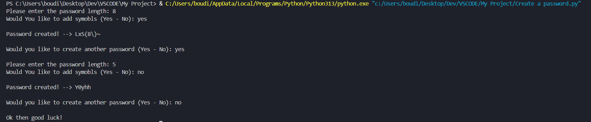

# 🔐 Password Generator (Python)

A simple and secure **password generator tool** built using Python.  
This program allows users to generate random passwords with customizable length and optional symbols for stronger security.

---

## 📸 Screenshot

---

## 🚀 Features

- 🔢 Custom password length input
- 🔁 Input validation for correct data types
- 🔣 Option to include symbols (Yes / No)
- 🔐 Generates strong random passwords
- 🔄 Ability to generate multiple passwords in one session
- 🧠 Beginner-friendly logic using loops and conditions

---

## 🛠️ Technologies Used

- Python 3
- `random` module
- `string` module
- Loops (while, for)
- Conditional statements
- Exception handling (try/except)

---

## 🧠 What I Learned

- How to work with Python built-in libraries (`random`, `string`)
- Generating secure random characters
- Improving user input validation
- Structuring interactive console applications
- Handling repeated program execution efficiently

---

## 📌 Future Improvements

- Add password strength indicator
- Allow saving passwords to a file
- Add GUI version using Tkinter
- Let users choose specific character types separately (uppercase, lowercase, digits, symbols)

---

## 👨‍💻 Author

**Abdullatif Traisi**  
